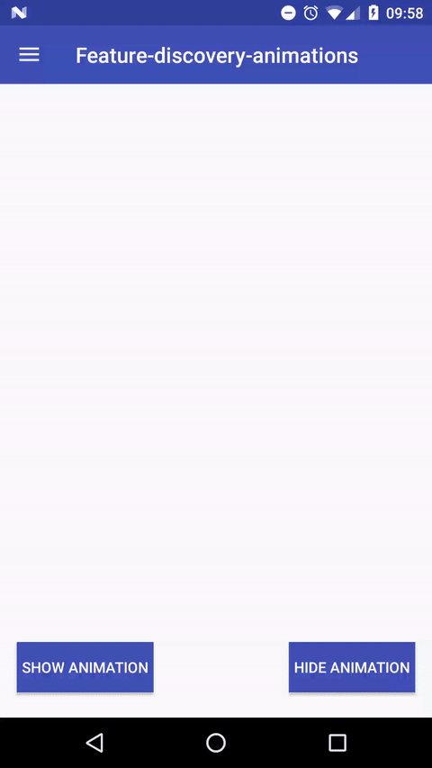

# Project Name

Feature-discovery-animations

Since May Google has updated his Material Design website. I have seen an interesting and cool design pattern in the new section named "Feature discovery" : https://www.google.com/design/spec/growth-communications/feature-discovery.html#feature-discovery-design-patterns. This is a sample to create the same animation.

Demo : 



#Android support

This sample has been made for Android 4.1+. To make it work for devices below Android 5 I had to disable hardware Acceleration. That's why in the Manifest you will find android:hardwareAccelerated="@bool/isBelowLollipop". With a boolean ressource in values and values-v21 we are able to set true to "hardwareAccelerated" depending of Android API.

I'm also using CircularReveal library (https://github.com/ozodrukh/CircularReveal) to support reveal animation below Android 5. This is the same code as if it was only made for API 21. So if you want to support only Android 5+ just change this :

```java
Animator anim = 
            io.codetail.animation.ViewAnimationUtils.createCircularReveal(view, cx, cy, initialRadius, 0);
```

to :

```java
Animator anim =
            ViewAnimationUtils.createCircularReveal(myView, cx, cy, 0, finalRadius);
```

And remove the dependencies in build.gradle :

```groovy
	repositories {
	    maven {
	        url "https://jitpack.io"
	    }
	}
```

```groovy
	dependencies {
	    compile ('com.github.ozodrukh:CircularReveal:2.0.1@aar') {
	        transitive = true;
	    }
	}
```

# Issues and Pull requests

Feel free to report issues and make pull requests. 
